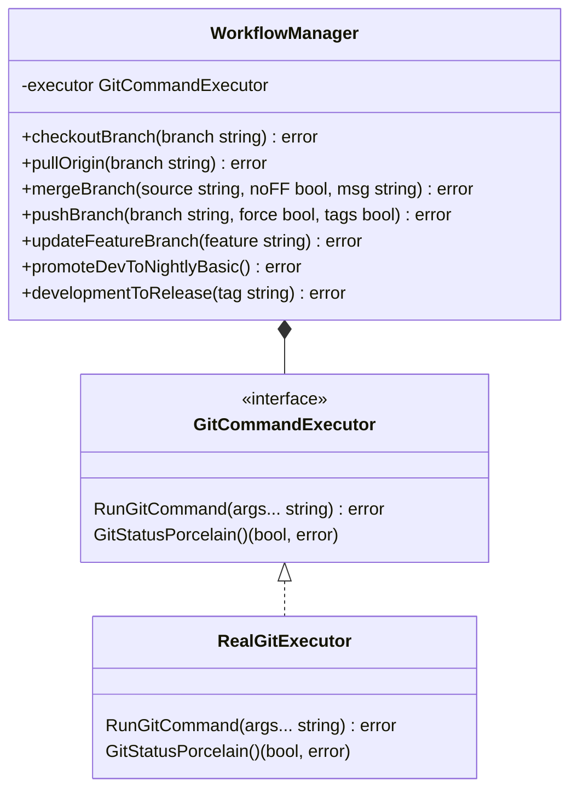

# Git Workflow Tool

A command-line tool to automate common Git branching workflows, following a structured branching model with Development, Nightly, Release, and main branches.

## Table of Contents
- [Installation](#installation)
- [Usage](#usage)
- [Commands](#commands)
  - [Feature Branch Workflow](#feature-branch-workflow)
  - [Development Branch Workflow](#development-branch-workflow)
  - [Promotion Workflows](#promotion-workflows)
  - [Hotfix Workflow](#hotfix-workflow)
  - [Maintenance Workflow](#maintenance-workflow)
- [Architecture](#architecture)
- [Error Handling](#error-handling)
- [Examples](#examples)
- [Best Practices](#best-practices)

## Installation

1. Ensure you have Go installed (version 1.16+ recommended)
2. Clone or download the repository
3. Build the tool:
   ```bash
   go build
   ```

## Usage

```bash
./git-workflow-tool <command> [arguments]
```

For help:
```bash
./git-workflow-tool help
```

## Commands

### Feature Branch Workflow

#### Create Feature Branch (`cfb`)
```bash
./git-workflow-tool cfb <feature-name>
```
- Creates a new feature branch from Development
- Branch naming: `feature/<feature-name>`

#### Update Feature Branch (`ub`)
```bash
./git-workflow-tool ub <feature-branch>
```
- Updates feature branch with latest Development changes
- Steps:
  1. Checks out feature branch
  2. Fetches latest changes
  3. Merges origin/development
  4. Pushes updates

#### Consume Feature (`cf`)
```bash
./git-workflow-tool cf <feature-branch>
```
- Merges feature branch into Development
- Includes conflict resolution workflow

### Development Branch Workflow

#### Update Development (`ud`)
```bash
./git-workflow-tool ud
```
- Pulls latest changes into Development branch
- Provides merge conflict resolution instructions if needed

### Promotion Workflows

#### Promote Development to Nightly (Basic) (`fmd`)
```bash
./git-workflow-tool fmd
```
- Basic promotion from Development to Nightly
- Fast-forward merge

#### Promote Development to Nightly (Validated) (`promote`)
```bash
./git-workflow-tool promote
```
- Validated promotion with:
  - Clean working directory check
  - No-fast-forward merge
  - Conflict resolution support

#### Promote Development to Release (`dr`)
```bash
./git-workflow-tool dr [version-tag]
```
- Promotes Development to Release branch
- Optional version tagging
- Handles branch creation if Release doesn't exist

### Hotfix Workflow

#### Create Hotfix (`ch`)
```bash
./git-workflow-tool ch <hotfix-name>
```
- Creates hotfix branch from main
- Branch naming: `hotfix/<hotfix-name>`

#### Update main with Hotfix (`um`)
```bash
./git-workflow-tool um <hotfix-branch>
```
- Merges hotfix into main
- Forward-ports to Development
- Cleans up hotfix branch

### Maintenance Workflow

#### Sync Development with main (`m`)
```bash
./git-workflow-tool m
```
1. Creates backup tag of Development
2. Hard resets Development to origin/main
3. Force pushes changes

**Warning:** Destructive operation - use with caution!

## Architecture



## Error Handling

The tool provides:
- Clear error messages with context
- Merge conflict resolution instructions
- Warning messages for destructive operations
- Validation of preconditions

Common error scenarios:
- Merge conflicts (with resolution steps)
- Uncommitted changes during promotion
- Missing branch arguments
- Network/Git operation failures

## Examples

### Feature Workflow Example
```bash
# Create feature
./git-workflow-tool cfb user-authentication

# Work on feature...
git add .
git commit -m "Implement auth service"

# Update with latest Development
./git-workflow-tool ub feature/user-authentication

# Merge to Development when ready
./git-workflow-tool cf feature/user-authentication
```

### Hotfix Workflow Example
```bash
# Create hotfix
./git-workflow-tool ch critical-security-fix

# Fix the issue...
git add .
git commit -m "Fix security vulnerability"

# Merge to main and Development
./git-workflow-tool um hotfix/critical-security-fix
```

## Best Practices

1. **Always pull latest changes** before starting work
2. **Resolve conflicts early** by merging Development into your feature branch
3. **Use descriptive names** for features/hotfixes
4. **Verify clean status** before promotions
5. **Backup important branches** before destructive operations
6. **Test merges locally** before pushing
7. **Coordinate with team** for branch promotions
```

This documentation provides:
1. Clear installation and usage instructions
2. Comprehensive command reference
3. Architecture overview
4. Error handling details
5. Practical examples
6. Best practices

The markdown includes:
- Proper section organization
- Code blocks for commands
- Mermaid diagram for architecture
- Warning callouts for dangerous operations
- Consistent formatting

You can extend this documentation with:
- More detailed examples
- Screenshots
- Video tutorials
- Team-specific workflow adaptations