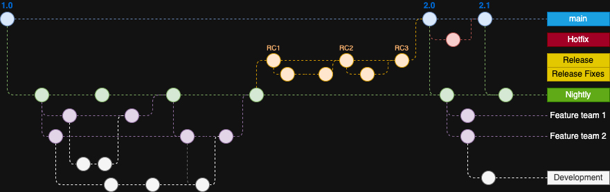
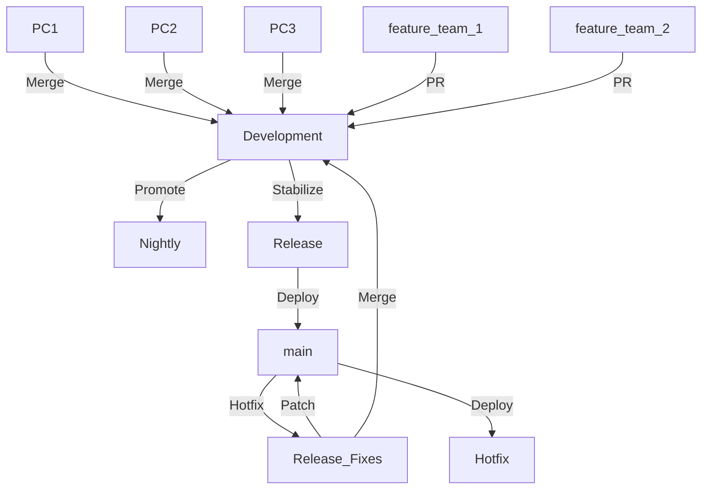

# GitHub Branching Strategy Analysis with DrawIO Visualization

## Related Documentation
- [GitHub Branching Strategy Analysis](Go.md) - Detailed explanation of the branching model this tool implements

## Branching Workflow Overview
Based on the provided `Github.png` labels, here's a comprehensive analysis of a potential GitHub branching strategy:



## Key Branches Explanation

### Main Branches
- **main**: Represents production-ready code (protected branch)
- **Release**: Stabilized branch for preparing production releases
- **Development**: Main integration branch for feature development

### Supporting Branches
- **Feature Teams**:
  - `feature team 1`: Dedicated to specific feature development
  - `feature team 2`: Parallel feature development stream
- **Hotfix/Release Branches**:
  - `Release Fixes`: For critical production fixes
  - `Nightly`: Potential CI/CD integration branch
- **Environment Branches**:
  - `Hotfix`: Possibly a staging/pre-production environment
  - `PC1/PC2/PC3`: Likely developer workspaces or test environments

## Workflow Path Analysis

### Standard Development Flow
1. `feature team 1/2` → `Development` → `Release` → `main`
2. `Nightly` builds likely pull from `Development`

### Hotfix Flow
1. `main` → `Release Fixes` (bugfix) → `main(via PR)
2. `Release Fixes` → `Development` (to maintain sync)

### Environment Promotion
`PC1/PC2/PC3` → `Hotfix` (staging) → `Release` → `main`

## Best Practices Observed
1. Clear separation of concerns between feature development and release stabilization
2. Dedicated branches for different environments
3. Parallel feature team workflows enable scaled development
4. Hotfix path maintains production stability

## Potential Improvements
1. Implement branch protection rules for `main` and `release`
2. Add version tagging strategy for `release` branches
3. Consider ephemeral feature branches (delete after merge)

## Visual Workflow Representation


|                | feature_team_* | Development | Nightly  | Release |  HotFix |  main |
|----------------|----------------|-------------|----------|---------|---------|---------|
| feature_team_* | U_B            | F_M_D       |          |         |         |         |
| Development    | C_F            | U_D         | Promote  | D_R     |         |         |
| Release        |                |             |          | Stabiliz|         | M       |
| HotFix         |                |             |          |         | U_H     | Deplo   |
| main         |                | M           |          |         | C_H     | U_M     |

**U_B**
```git
# Switch to your feature branch
git checkout feature-branch

# Fetch latest changes from all remotes (but don't merge anything yet)
git fetch origin

# Merge the latest remote development branch into your feature branch
git merge origin/development

# Resolve any merge conflicts manually if prompted

# Push the updated feature branch
git push origin feature-branch

```

**U_D**
```git
git checkout Development
git pull origin Development

# If conflicts occur:
git status  # View conflicting files
# Manually edit files (remove <<<<<<<, =======, >>>>>>> markers)
git add .
git commit -m "fix: Resolve merge conflicts"
git push origin Development

```

**F_M_D**
```git
---------------------------------------
git checkout Development
git pull origin Development
---------------------------------------
# Switch to the Nightly branch
git checkout Nightly

# Make sure it's up to date with the remote
git pull origin Nightly

# Fetch the latest changes from the remote
git fetch origin

# Merge the Development branch into Nightly
git merge origin/Development

# Resolve any merge conflicts if they occur

# Push the updated Nightly branch
git push origin Nightly

```


**F_D**
```git
git checkout Development
git checkout -b feature/your-feature-name
```

**C_F**
```git
# Switch to your feature branch
git checkout feature-branch

# Pull latest changes from remote feature branch
git pull

# Update local Development branch
git checkout Development
git pull origin Development  # Ensures you're working with latest Development changes

# Merge Development into feature-branch
git checkout feature-branch
git merge Development  # Resolve any conflicts, if they arise

# Merge updated feature-branch back into Development
git checkout Development
git merge feature-branch  # Final merge

# (Optional) Push updated Development branch to remote
git push origin Development

```

**U_B**
```git
# Update local Development branch
git checkout Development
git pull origin Development  # Ensures you're working with latest Development changes
```

**Promote**
```bush
#!/bin/bash
# Promote Development to Nightly with validation

# 1. Verify Development is clean
git checkout Development
if [[ -n $(git status --porcelain) ]]; then
  echo "Error: Development has uncommitted changes"
  exit 1
fi

# 2. Update local branches
git fetch origin
git pull origin Development

# 3. Merge to Nightly
git checkout Nightly
if ! git merge origin/Development --no-ff; then
  echo "Merge conflict detected! Resolve manually:"
  echo "1. Fix conflicts"
  echo "2. git add ."
  echo "3. git merge --continue"
  exit 1
fi

# 4. Push with CI trigger
git push origin Nightly

# 5. Create GitHub deployment (requires GitHub CLI)
gh api repos/:owner/:repo/deployments \
  -f ref='Nightly' \
  -f environment='nightly' \
  -f description='Nightly promotion'
```
**D_R**
```git
# 1. Ensure you have the latest Development branch
git checkout Development
git pull origin Development

# 2. Create or update the Release branch
git checkout Release || git checkout -b Release  # Creates Release if it doesn't exist
git pull origin Release  # Only needed if Release already exists

# 3. Merge Development into Release (with --no-ff to preserve merge history)
git merge Development --no-ff -m "chore: Promote Development to Release [$(date +%Y-%m-%d)]"

# 4. Resolve conflicts if any (manual intervention may be needed)
# [Fix conflicts, then:]
git add .
git commit -m "fix: Resolve merge conflicts"

# 5. Push to remote
git push origin Release

# 6. (Optional) Tag the Release
git tag -a v1.2.0 -m "Release candidate 1.2.0"
git push origin v1.2.0
```

**M**
```git
---------------------------------
git checkout Development
git tag backup/development-$(date +%Y%m%d)
git push origin --tags
--------------------------------
git checkout Development
git fetch origin
git reset --hard origin/main
git push origin Development --force

```

**C_H**
```git
# Step 1: Switch to main and ensure it's up to date
git checkout main
git pull origin main

# Step 2: Create a new hotfix branch from main
git checkout -b hotfix/fix-issue-name

# Step 3: Push the hotfix branch to the remote repository
git push origin hotfix/fix-issue-name
```

**U_M**
```git
# 1. Merge to main
git checkout main
git merge hotfix/issue-123 --no-ff

# 2. Push to production
git push origin main

# 3. Forward-port to Development
git checkout Development
git merge hotfix/issue-123 --no-ff -m "chore: Forward-port hotfix #123 to Development"

# 4. Push updates
git push origin Development

# 5. Cleanup (optional)
git branch -d hotfix/issue-123
git push origin --delete hotfix/issue-123
```

| Phase          | Action                                                                 | CLI Command                                                                 | Web Alternative                                                                 |
|----------------|-----------------------------------------------------------------------|-----------------------------------------------------------------------------|---------------------------------------------------------------------------------|
| **Development** | Create feature branch                                                | `git checkout -b feature_team_1`                                            | GitHub UI: "New branch" button                                                  |
|                | Push changes                                                         | `git push origin feature_team_1`                                            |                                                                                 |
| **PR Creation** | Open PR to Development                                               | `gh pr create -B Development -t "Feature X"`                                | GitHub UI: "New pull request" button                                            |
| **Code Review** | Address comments                                                     | `git commit --amend` then `git push -f`                                     | GitHub UI: Commit suggestions/GitHub Desktop                                    |
| **Merge**      | Approve & merge                                                      | `gh pr merge -m -d`                                                        | GitHub UI: "Merge pull request" button                                          |
| **Release**    | Promote to Release                                                   | `git checkout Release && git merge Development --no-ff`                     | GitHub UI: Create new PR from Development→Release                               |
| **Production** | Deploy to main                                                     | `git checkout main && git merge Release --no-ff`                          | GitHub UI: Create PR from Release→main with production checklist              |
| **Hotfix**     | Emergency patch                                                      | `git checkout -b hotfix main && git push origin hotfix`                   | GitHub UI: Create hotfix branch from main                                    |
